# working-with-docker-images

# Working-with-Docker-images

## INTRODUCTION TO DOCKER IMAGES:

Docker images are the building blocks of containers. They are lightweight, protable and self-sufficient packages that contains everythimg needed to run a software application, including the code, runtimes, libraries, and system tools. Images are created from a set of instructions such as Dockerfile, which specifies the environment and configuration for the application.

## PULLING IMAGES FROM DOCKERHUB:
Dockerhub is a cloud-based registry that hosts a vast collections od docker images. The ´´docker pull´´ command is used to pull images from dockerhub to your local machines. 

### ``docker search ubuntu``
This command is used to search various images hosted on dockerhub.

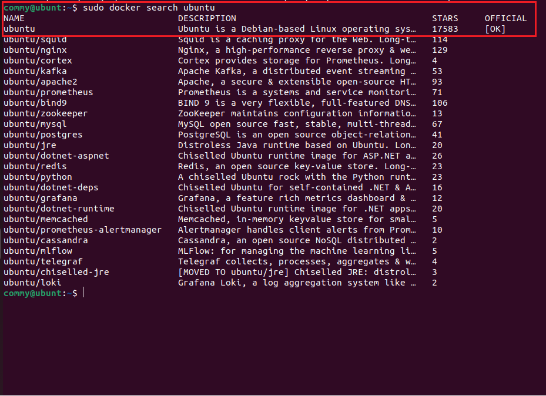

In the 'Official Column' the OK designation signifies that an image has being contructed and is officially supported by the organisation responsible for the project.

## ``docker pull ubuntu``

Executing this command will fetch the official ubuntu image from docker hub and store it locally on your machime, making ready for use in creating containers.

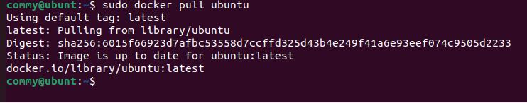

Onces the image has being successfully downloaded, you proceed to run a container using the downloaded image. If an image is the present locally, the ´´docker run´´ subcommand, docker will automatically download the image before initiating the container.

## ``docker images``

This subcommand is use to view docker images that has been downloaded on your local machine, gathering information about its size, version and other details.

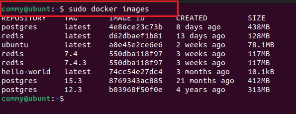

## DOCKERFILE:

Dockerfile is a plaintext configuration files that contain a set of instructions for building a docker image.

Using a text-editor, dockerfile can be created.
For example: 

``#use the official NGINX base image
FROM nginx:latest
#Set the working directory in the container
WORKDIR  /usr/share/nginx/html/
#Copy the local HTML file to the NGINX default public directory
COPY index.html /usr/share/nginx/html/
#Expose port 80 to allow external access
EXPOSE 80
#No need for CMD as NGINX image comes with a default CMD to start the server``

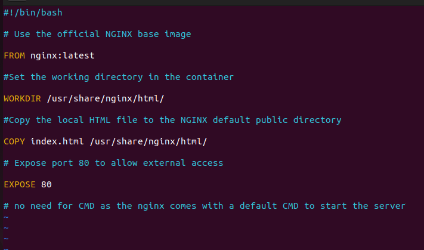

create index.html with a text editor in the same directory of the Dockerfile.

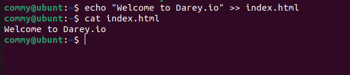

## Explanation of the code snippet above:

1. FROM nginx:latest: Specifies the official NGINX base image from Docker Hub.
2. WORDIR /usr/share/nginx/html/: Specifies the working directory in the container.
3. COPY index.html /usr/share/nginx/html/: Copies the local index.html file to the nginx default public directory, which is where nginx serves static content from.
4. EXPOSE 80: Informs docker that the nginx server will use port 80. This is a documentation feature and actually doesnt publish the port.
5. CMD: NGINX images comes witha default CMD to start the server.

   To build an image from this Dockerfile, Navigate to the directory containing the file and the run.

    ## ``docker build -t dockerfile .``

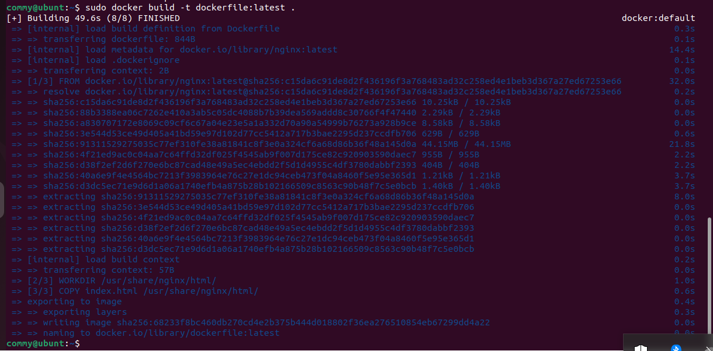

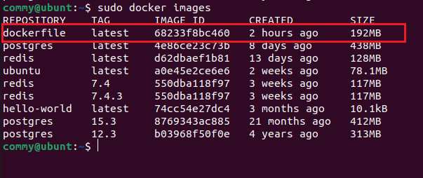

## ``docker run -p 8080:80 dockerfile``

To run a container base on the custom NGINX image we created with the dockerfile, run the command.

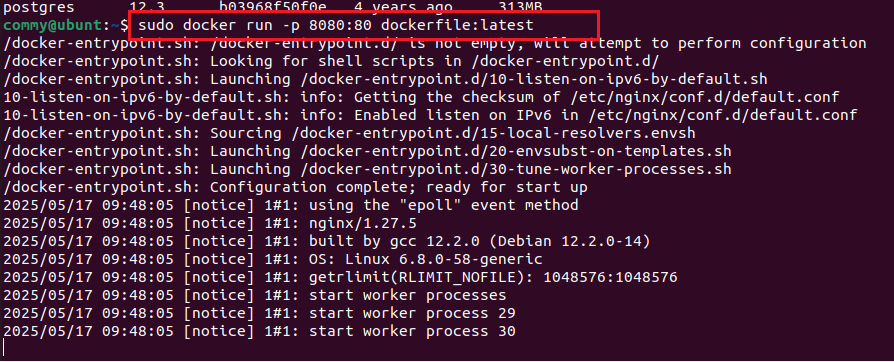

Running the command above will create a container that listens on port 8080 using the nginx image created earlier.

So there is need to create new rule in the EC2 inbound rules.

i. On our EC2 instance, click on security tab:

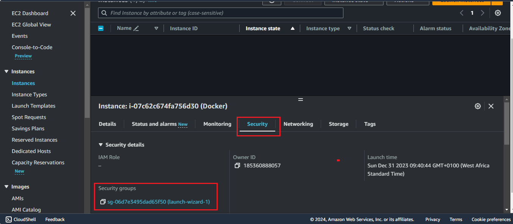

ii. Click on the edit inbound rule. This will allow  incoming traffic to instance associated with the security group. Our aim is to allow incoming traffic on port 8080.

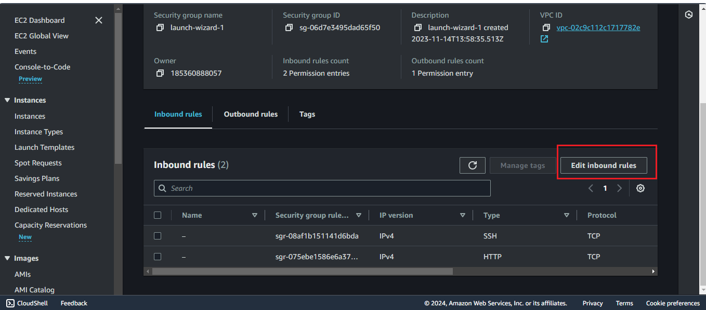

iii. Click of ´´add rule´´  to add a new rule.

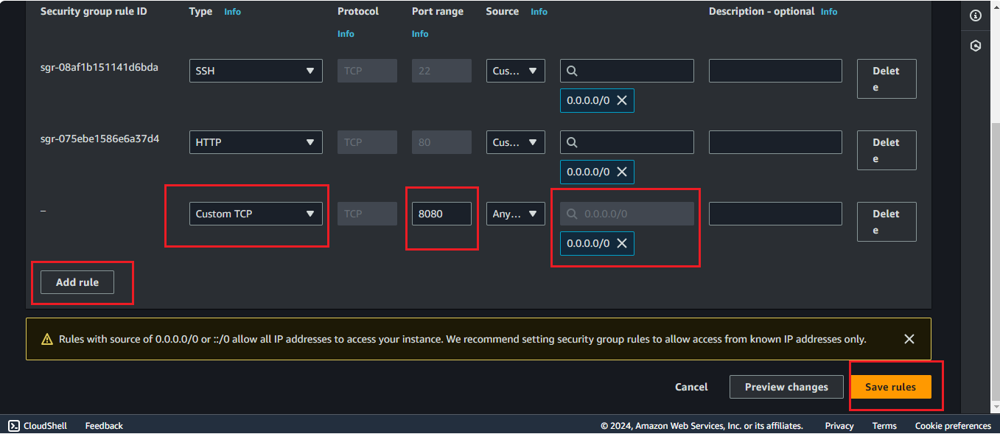

Lets see the available containers.

``docker ps -a``

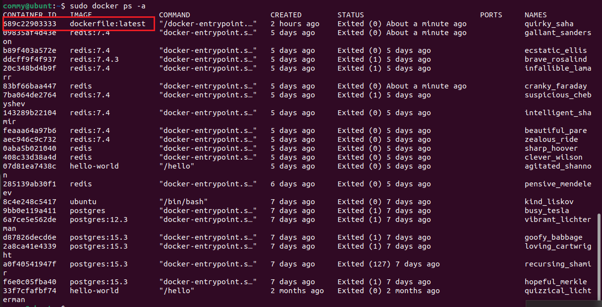

The image above shows our container is not running yet, we can start it with command below

``docker start CONTAINER_ID``

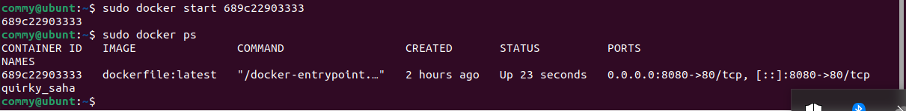

Now that we have started our container, we can access the content on our web browser with http://publicip_address:8080
or http://localhost:8080 on our local machine.

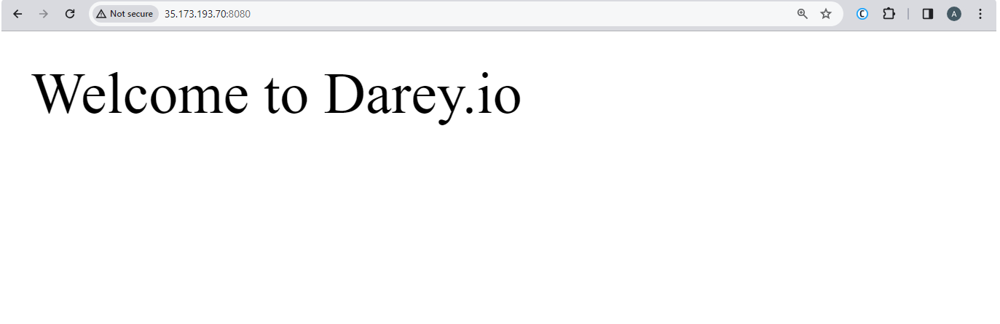

## Pushing Docker Images to Docker Hub

i. Create a repository on Docker hub account

ii. Tag your Docker image before pushing,tag with Docker username and the repository name.

``docker tag <your-image-name> <your-dockerhub-username>/<your-repository-name>:<tag>``

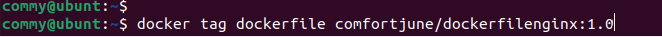

iii. Login to Dockerhub 

``docker login -u <your-docker-hub-username>``

Running this commang will prompt you for a password. Authenticate using Dockerhub password.

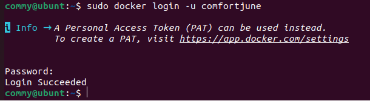

iv. Push image to Docker hub

``docker push <your-dockerhub-username>/<your-repository-name>:<tag>``

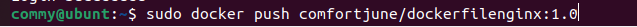

v. Verify image is in Dockerhub repository

Now anyone can make use of the images you have on Docker hub repository.

